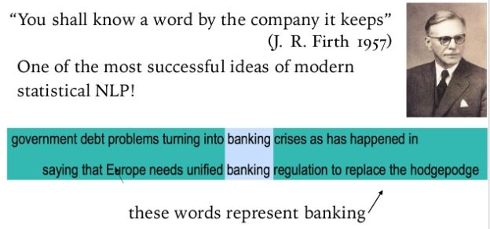
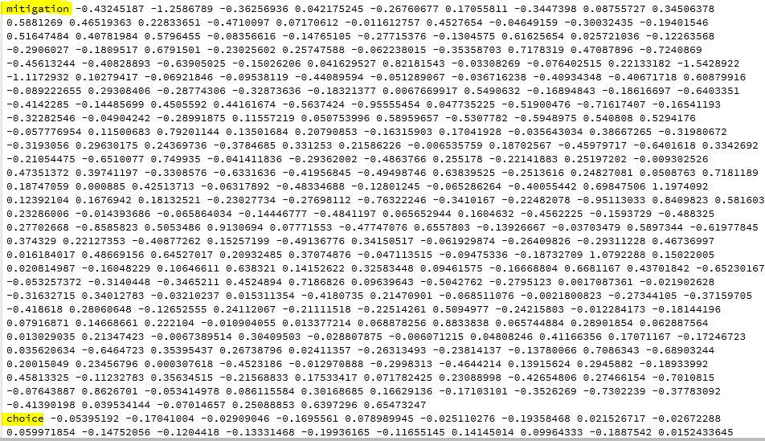
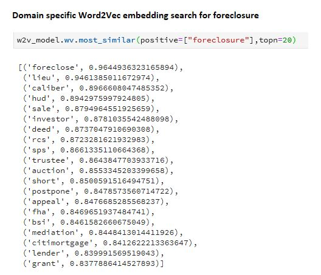

# Training domain specific Word2Vec word embedding model with Gensim

In this post, I will show how to train your own domain specific Word2Vec model using your own data. There are powerful, off the shelf embedding models built by the likes of Google (Word2Vec), Facebook (FastText) and Stanford (Glove) because they have the resources to do it and as a result of years research. These models that were trained on huge corpus generally perform well but there are times they fail on specific tasks in industries like health, finance and legal. There are two approaches to solve this problem. First, train your own embeddings if you have enough data of over a million text documents and the compute power. Two, fine-tune one of the listed models above with your data, especially, when your data is small (I will post a follow up blog to show how to fine-tune word2vec models).

Word2Vec assumes two words that have the same context will also share the same meaning and therefore, both words will have similar vector representation. The vector of a word is a semantic representation of how that word is used in context. being able to represent words as dense vectors is the core of the successes registered in the application of deep learning to NLP in recent times. 

Word2vec utilize two model architectures, continuous bag-of-words (CBOW) or continuous skip-gram. For models that use continuous bag-of-words, a current word is predicted from a window of surrounding context words. In other words, you hide the target word and use the surrounding words to predict the hidden word. The order of surrounding words does not influence prediction.

In the case of continuous skip-gram architecture, the current word in the model is used  to predict the surrounding window of the context words. The skip-gram architecture gives more weight to nearby words than distant words. CBOW is faster than skip-gram but skip-gram performs better when it comes to infrequent words.

Before Word2Vec became popular, one hot encoding which has sparsity problem, where most of the rows will be zeros for a very wide dimension. The dimension is the same as the number of words in the corpus. Each word will represent a column. This is very expensive for computation. Word2Vec solved this problem by representing each word as mostly 300 dimension space.

After converting words to vector representations, math can be done on the vectors. You could find answers to analogy questions like:

*Columbus is to Ohio as what is to Illinois?*

*word vector(Columbus) - word vector(Ohio) + word vector(Illinois) = Chicago*

Or the popular one:

*King - Man + woman   is Queen*

From the code example for our domain specific model, we are able to find the most similar words to *foreclosure*. If you are familiar with the mortgage industry, you will notice most of the words on the list are real estate related. This is not the best results because we trained the model on only 66k documents instead of over a million documents required. This is a good thing for our future comparison because we will use the same 66k documents in our next project to proof that when your data is small, fine-tuning an existing embedding is the way to go.

If you need to read more about Word2vec and embeddings, this is a good article on [kdnuggets](https://www.kdnuggets.com/2019/02/word-embeddings-nlp-applications.html) or this fantastic podcast by [Data Skeptic](http://dataskeptic.com/blog/episodes/2019/word2vec)

